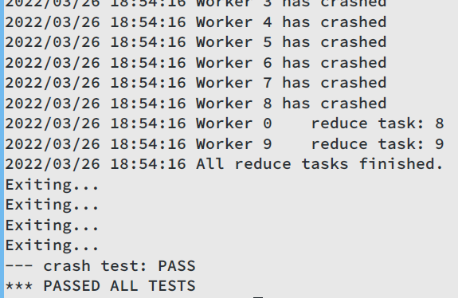

# 6.824
2022 Spring 6.824 Labs

## Lab 1 MapReduce

将串行实现改为并行实现；使用coordinator而不是论文中的master；在单机运行；worker和coordinator之间用RPC通信；要求修改`mr/worker.go`，`mr/coordinator.go` 和 `mr/rpc.go`

### 相关注意点

- 启动`Coordinator`时传入的参数`pg-*.txt` 是输入文件，每个文件对应一个split（相当于简化了论文中需要coordinator手动分片的工作）
- 切入点：worker发送RPC请求至coordinator请求任务，coordinator返回文件名，worker读取该文件，调用map函数
- 每个mapper需要将中间键值对划分为`nReduce` 个临时文件，存放在当前文件夹，以便后续worker读入；可以用`ihash(key)` 确认某个键对应的reduce任务
- 可以以json格式存储中间键值对
- 临时文件的一种命名方式为`mr-X-Y` ，X是map任务号，Y是reduce任务号
- 所有map任务结束后，coordinator才会分发reduce任务，worker可以周期性地请求任务
- 第X个reduce任务的输出文件名应该为`mr-out-X` 格式
- `Coordinator` 需要实现`Done()` 方法，整个MapReduce任务完成时，返回true，之前返回false
- worker需要在MapReduce任务完成后退出，一种实现是coordinator发送“退出”伪任务给worker
- coordinator的RPC服务器是并行的，共享数据**注意加锁**
- worker超时为10秒，超过10秒未响应，coordinator认定该worker崩溃，重新调度其运行的任务
- 为防止崩溃造成输出文件半完成状态，可使用`ioutil.TempFile` 创建临时文件，完成写入后再`os.Rename`改名
- 注：每次修改`mr/`文件夹下的代码，都需要重新编译MapReduce插件

### 具体实现

- Coordinator结构体

  ```go
  type Coordinator struct {
     // Your definitions here.
     mutex sync.RWMutex
  
     workers []WorkerInfo
  
     mapTasks           []TaskInfo
     unfinishedMapTasks int // number of unfinished map tasks
     nMap               int // number of map tasks
  
     reduceTasks           []TaskInfo
     unfinishedReduceTasks int // number of unfinished reduce tasks
     nReduce               int // number of reduce tasks
  }
  ```

- Coordinator RPC endpoints:

  - `Heartbeat`：接收worker心跳包
  - `ShakeHands`：与worker握手，交换基本信息（nReduce等）
  - `Task`：给worker分配任务：Map、Reduce、Nop、Exit
  - `Finish`：接收任务完成信息

- `Done()` 实现：返回`unfinishedReduceTasks==0`

- 健康检查：由worker每2秒主动上报（心跳包形式）；coordinator运行一个goroutine，每10秒检查一次workers活性，有失活的worker（10秒内未发送心跳包）且其有未完成的任务，将该任务重新分配

### 结果

通过所有测例



Lab 1总耗时：9小时31分（数据来源：wakatime）


